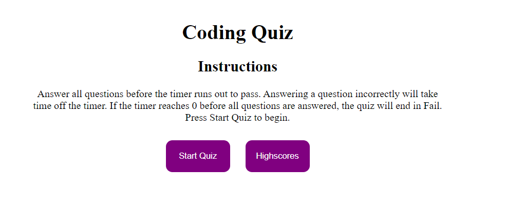
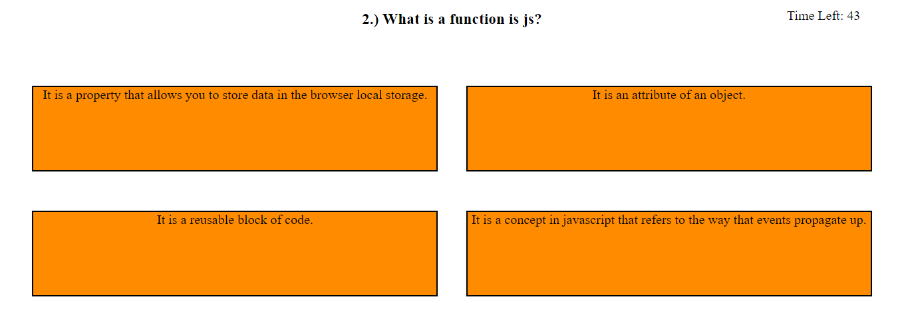
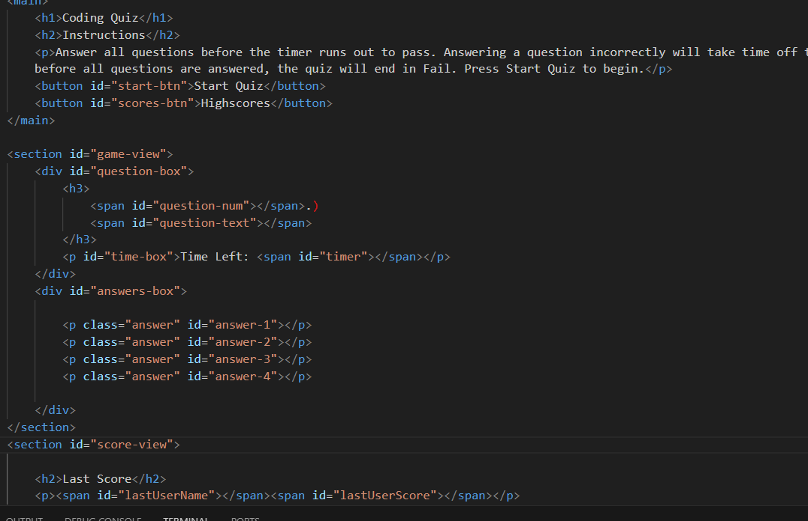

# Coding Practice Quiz

This web page is a timed quiz on JavaScript that stores scores, so that users can gauge their learing progress compaired to their peers.

## How to Use

The webpage can be viewed at [here](https://kal-a11y.github.io/coding-practice-quiz/) or the link in the 'About' section of [this repository](https://github.com/Kal-a11y/coding-practice-quiz).

Read the description on the homepage. Start the quiz and answer questions before time runs out. If you pass, save your initials to compair to the last user.

## The Code

## License
 
 N/A

## Sources

N/A

